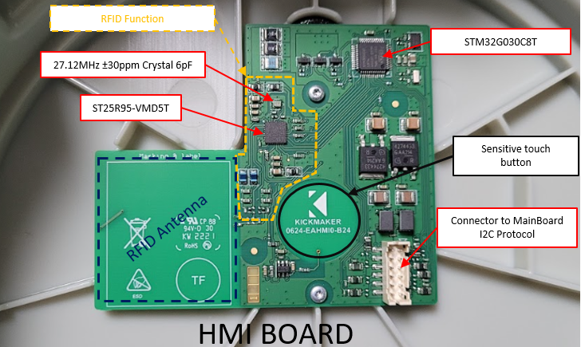
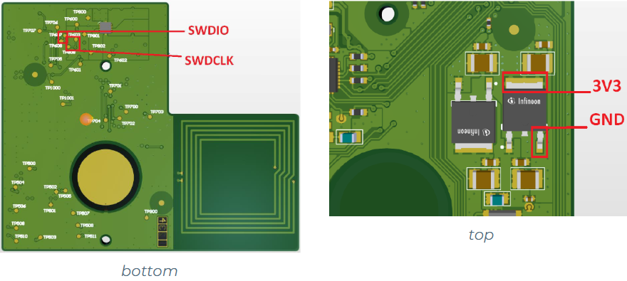
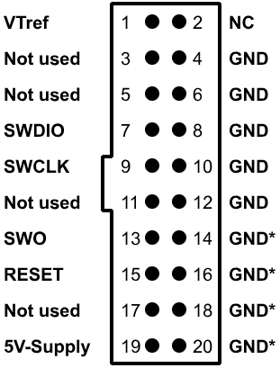

# CSGen1HMI

HMI Board is a peripheral board, in charge of the interraction with a user.
This HMI Board is included in a charging station.
Mains features of the board is :

* NFC Tag Reading.
* Leds driving.
* Touch Sensor detection.
* Communication in I2C with a Main Board.
* Internal Temperature monitoring.

## Hardware

This HMI embeds: 
* MCU : STM32g030C8Tx
* NFC: ST95hf
* Touch: AT42QT1011
* Led driver: DMN61D8L



## HMI sw debug

### Target interface SWD 

ARM's **S**erial **W**ire **D**ebug (**SWD**) replaces the traditional 5-pin JTAG debug interface by introducing a 2-pin interface with a clock (SWDCLK) and a single bi-directional data pin (SWDIO), providing all the normal JTAG debug and test functionality. 

SWDIO and SWCLK are overlaid on the TMS and TCK pins, allowing to use the same connector for JTAG and SWD. In order to communicate with a device via SWD, data is send on SWDIO, synchronous to the SWCLK. With every rising edge of SWCLK, one bit of data is transmitted or received on the SWDIO pin.

### SWD wiring on PCB

- SWDCLK signal on test point number TP608 (bottom).
- SWDIO signal on test point number TP607(bottom).
- Vref 3.3V on LDO (top).
- GND on LDO (top).



### SWD interface on Segger JLINK

The J-Link and J-Trace JTAG connector is also compatible to ARM's Serial Wire Debug (SWD).

The following table lists the J-Link / J-Trace SWD pinout.

| Pin |   Signal  |  Type  | Description                                                                                                                                                                                                                                                                                         |
|:---:|:---------:|:------:|-----------------------------------------------------------------------------------------------------------------------------------------------------------------------------------------------------------------------------------------------------------------------------------------------------|
|  1  | VTref     | Input  | This is the target   reference voltage. It is used to check if the target has power, to create the   logic-level reference for the input comparators and to control the output   logic levels to the target. It is normally fed from Vdd of the target board   and must not have a series resistor. |
|  2  | Vsupply   | NC     | This pin is not connected   in J-Link. It is reserved for compatibility with other equipment. Connect to   Vdd or leave open in target system.                                                                                                                                                      |
|  3  | Not used  | NC     | This pin is not used by   J-Link. If the device may also be accessed via JTAG, this pin may be   connected to nTRST, otherwise leave open.                                                                                                                                                          |
|  5  | Not used  | NC     | This pin is not used by   J-Link. If the device may also be accessed via JTAG, this pin may be   connected to TDI, otherwise leave open.                                                                                                                                                            |
|  7  | SWDIO     | I/O    | Single bi-directional data   pin.                                                                                                                                                                                                                                                                   |
|  9  | SWCLK     | Output | Clock signal to target CPU.   It is recommended that this pin is pulled to a defined state of the target   board. Typically connected to TCK of target CPU.                                                                                                                                         |
|  11 | Not used  | NC     | This pin is not used by   J-Link. This pin is not used by J-Link when operating in SWD mode. If the   device may also be accessed via JTAG, this pin may be connected to RTCK,   otherwise leave open.                                                                                              |
|  13 | SWO       | Input  | Serial Wire Output trace   port. (Optional, not required for SWD communication.)                                                                                                                                                                                                                    |
|  15 | nRESET    | I/O    | Target CPU reset signal.   Typically connected to the RESET pin of the target CPU, which is typically   called "nRST", "nRESET" or "RESET". This signal   is an active low signal.                                                                                                                  |
|  17 | Not used  | NC     | This pin is not connected   in J-Link.                                                                                                                                                                                                                                                              |
|  19 | 5V-Supply | Output | This pin is used to supply   power to some eval boards.                                                                                                                                                                                                                                             |
Pins 4, 6, 8, 10, 12, 14, 16, 18, 20 are GND pins connected to GND in J-Link. They should also be connected to GND in the target system.



## Setup i2c interface with Beagle Play

### Connect to Wifi Beagle hotspot
* Wifi host : BeaglePlay-xxx
* Password : BeaglePlay or Beagle board

### Connect thru SSH

```
l-dtil@CRE2-L05426:~$ ssh debian@192.168.8.1
```

* Password : temppwd

### Discover I2C

```
debian@BeaglePlay:~$ i2cdetect -l
i2c-3	i2c       	OMAP I2C adapter                	I2C adapter
i2c-1	i2c       	OMAP I2C adapter                	I2C adapter
i2c-2	i2c       	OMAP I2C adapter                	I2C adapter
i2c-0	i2c       	OMAP I2C adapter                	I2C adapter
i2c-5	i2c       	OMAP I2C adapter                	I2C adapter
```

I2C-5 is the QWIIC connection


## Functional

### Registers list

| REG_ID | Register                                | Access | Purpose     | Description |
|:------:|-----------------------------------------|:------:|:-----------:|-------------|
| 0x00   | HMI_REG_VERSION_NUM                     | R      | common      |  |
| 0x01   | HMI_REG_VERSION_SRING                   | R      | common      |  |
| 0x02   | [HMI_REG_IRQ](#hmi_reg_irq-register)    | R/W    | common      | Notify master which interrupt occured |
| 0x03   | HMI_REG_IER                             | R/W    | common      | Interupt enable register |
| 0x04   | HMI_REG_CPUID                           | R      | common      | STM32 UID |
| 0x05   | HMI_REG_NFC_LEN                         | R      | common      |  |
| 0x06   | HMI_REG_NFC_UID                         | R      | common      |  |
| 0x07   | HMI_REG_CHARGE_STATE_MAIN               | R/W    | indication  |  |
| 0x08   | HMI_REG_CHARGE_STATE_DYN                | R/W    | indication  |  |
| 0x0A   | HMI_REG_CHARGE_STATE_FLAGS              | R/W    | indication  |  |
| 0x0B   | HMI_REG_TEMPERATURE                     | R      | common      | Board temperature in °C |
| 0x0C   | HMI_REG_PWM                             | R/W    | common      | Led brightness |
| 0x22   | HMI_REG_HEARTBEAT                       | W      | common      |  |
| 0x23   | HMI_REG_DEBUG_NFC_UID_LEN               | R/W    | debug       |  |
| 0x24   | HMI_REG_DEBUG_NFC_UID                   | R/W    | debug       |  |
| 0x33   | HMI_REG_TEMP_THRESHOLD                  | R/W    | debug       |  |
| 0x35   | HMI_REG_CAPACITIVE_TOUCH_BUTTON_DELAY   | R/W    | common      |  |
| 0x36   | HMI_REG_CAPACITIVE_FORCED_CHARGE_DELAY  | R/W    | common      |  |
| 0x37   | HMI_REG_STATUS_HMI_RFID_ENABLED         | R      | common      |  |
| 0x38   | HMI_REG_HEARTBEAT_LOST_FREQUENCY        | W      | common      |  |

### Read register - general

```
i2cget -y 3 0x50 REG_ID wp
```
Replace REG_ID with the register id from the table above.

For long data (Sw version, NFC UID, etc)

```
i2ctransfer -y 2 w1@0x50 0x00 r4
```

### HMI_REG_CHARGE_STATE_MAIN

Writing value in this register set the user led pattern

```
i2cset -y 3 0x50 0x07 REG_VALUE wp
```

| State                        | Led pattern                                                                  | Register value |
|------------------------------|------------------------------------------------------------------------------|:--------------:|
| Initialization               | Green, Blue and Red   Leds with two blinks for each before, without timeout. |     0x0016     |
| Available                    | Green Led without a timeout                                                  |     0x0010     |
| Electrical Vehicle connected | Green Led with blinking frequency of 1   Hz, without timeout.                |     0x0011     |
| On charge                    | Blue Led without timeout.                                                    |     0x0012     |
| Wait RFID                    | Blue Led with a blinking frequency of 500   ms                               |     0x0014     |
| Charging Station Booked      | Blue Led with blinking frequency of 0.5   Hz, without timeout.               |     0x0015     |
| Out Of Service               | Red Led without timeout.                                                     |     0x0013     |
| Cloud Disconnected           | Red Led with blinking frequency of 1 Hz,   without timeout.                  |     0x0031     |
| RFID Declined                | Red Led with blinking frequency of 4 Hz,   with timeout of 2 second          |     0x0021     |
| Touch Detected               | Yellow (red+green leds)                                                      |     0x0017     |

### HMI_REG_IRQ register

#### Read register
```
i2cget -y 3 0x50 0x02 wp
```
#### Returned value

0x0000 means no IRQ happen

| Bit | Mask | Description             |
| :-: | :--: | ----------------------- |
| 0   | 0x01 | RFID interrupt occured  |
| 0   | 0x10 | Force charge interrupt occured  |
| 5   | 0x20 | Touch interrupt occured |


#### Clear register

To clear IRQ register, write 0xFF.
```
i2cset -y 3 0x50 0x02 0xFFFF wp
```

Read back register. 0x0000 value is expected
```
i2cget -y 3 0x50 0x02 wp
```

Selective clear can also be performed using bitmask instead of 0xFFFF value.

### PWM
| Duty cycle | Hexa value |
|:---:|:---:|
| 1   | 0x000A   |
| 2   | 0x0014  |
| 5   | 0x0032  |
| 10  | 0x0064  |
| 20  | 0x00C8  |
| 30  | 0x012C |
| 40  | 0x0190 |
| 50  | 0x01F4 |
| 60  | 0x0258 |
| 70  | 0x02BC |
| 80  | 0x0320 |
| 90  | 0x0384 |
| 100 | 0x03E8 |
